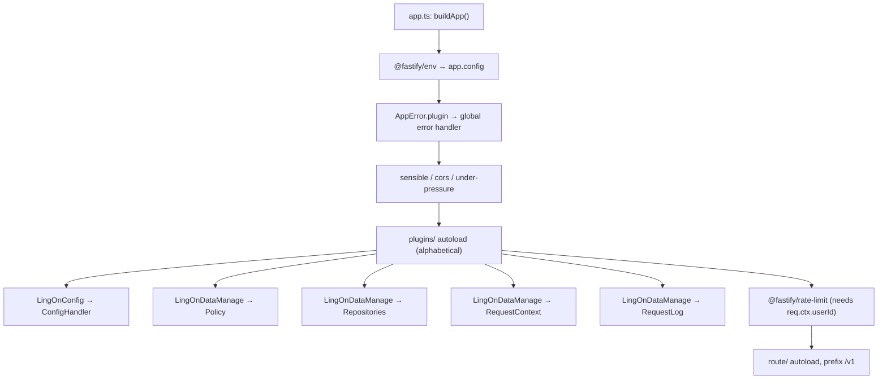
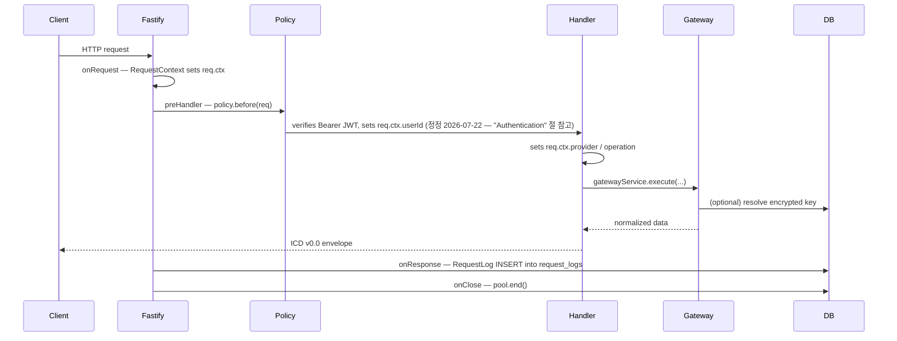

# Backend Development Guide

Scope: this document covers **backend-only** conventions for the Lingon
Fastify application. Cross-repo design (ICD, shared architecture) lives in
`./docs` (LetMeKnow-Docs submodule) — do not duplicate it here.

> **⚠ 2026-07-21 전략 검토**: 이 미러 저장소(`LingOnDevDocs`)에서 위 `./docs`는
> 실제로 저장소 루트 [../../docs/](../../docs/)에 있다. Personal Action OS 전략
> 전환에 따른 Action Layer ICD 제안은 [../../docs/icd/](../../docs/icd/)를 참조 —
> 이 문서(백엔드 구현 컨벤션) 자체는 변경되지 않았다.

For the authoritative source layout and command reference, see the backend
source repository's `CLAUDE.md` (not mirrored into this docs-only repository —
see [requirements/README.md](../../requirements/README.md)). This guide
explains *why* the conventions exist and *how* to extend them.

## Fastify structure

`@fastify/autoload` registers files alphabetically within a directory:
`plugins/LingOnDataManage/` loads `Policy` → `Repositories` →
`RequestContext` → `RequestLog`, in that order. Despite `RequestContext`
loading after `Policy`, `req.ctx` is still guaranteed populated before
`Policy.before` runs — because Fastify executes hooks by **hook type**
across all plugins (every `onRequest` hook, which is what `RequestContext`
registers, runs before any `preHandler` hook, which is what `Policy.before`
registers), not by plugin file registration order. See the note in
[RequestContext.ts](../../src/plugins/LingOnDataManage/RequestContext.ts) and
[backend/docs/plugins/request-context.md](plugins/request-context.md) for
detail. Rate limiting is registered **after** the whole `plugins/` autoload
block specifically so its `keyGenerator` can read `req.ctx.userId`.

### Request lifecycle

## Route rules

- One route group per file under `src/route/`, extending `BaseRoutes`
  ([BaseRoutes.ts](../../src/core/base/BaseRoutes.ts)).
- Set `readonly name` to a unique kebab-case identifier (used for logging/plugin naming).
- Implement `registerRoutes(app)` — register all endpoints for the group here.
- Export a default `FastifyPluginAsync` that instantiates the class (with any
  injected deps, e.g. a gateway) and calls `app.register(routes.asPlugin())`.
  This is the shape `@fastify/autoload` expects.
- Files are auto-registered under the `/v1` prefix — do not hardcode `/v1` in
  route paths.
- Before calling a gateway, set `req.ctx.provider` and `req.ctx.operation` so
  `RequestLog.ts` can populate `request_logs.provider` / `.operation`.
- Handlers return the ICD v0.0 envelope directly — never return raw
  provider/DB data.
- Route-level validation is done by hand at the top of each handler (`assert*`
  helpers, or inline checks) — see [Validation](#validation).
- Static routes must be registered before dynamic/param routes that could
  shadow them (e.g. `/apikey/status` before `/apikey/:provider` in
  [LingOnApiKey.ts](../../src/route/LingOnApiKey.ts)).

## Plugin rules

- One plugin per concern, under `src/plugins/<Group>/<Name>.ts`, wrapped in
  `fastify-plugin` (`fp(...)`) so decorations are visible to sibling plugins
  and routes rather than being scoped to a child context.
- Decorate `app` (`app.decorate(...)`) for anything routes need to read, and
  declare the shape in [FastifyDefinition.ts](../../src/config/FastifyDefinition.ts)
  so TypeScript enforces correct usage everywhere.
- Directory/file naming controls load order (alphabetical) — pick names that
  encode the required order when one plugin's hook depends on another's
  decoration.
- Plugins that add DB-backed side effects (e.g. `RequestLog.ts`) must wrap
  every DB call in `try/catch` — a logging failure must never affect the
  HTTP response.

## Service rules (gateways)

- One gateway per external provider, under `src/gateway/`, extending
  `BaseGateway` ([BaseGateway.ts](../../src/core/base/BaseGateway.ts)).
- Implement `readonly name` and `execute(input: ProviderRequest)`, dispatching
  on `input.route` with a `switch`; throw `AppError('OP_NOT_SUPPORTED', 400, ...)`
  for unknown routes.
- Use the protected helpers (`getJson`, `getJsonWithApiKey`, `buildUrl`,
  `assertLatLon`, `assertRequiredString`) instead of calling `fetch` directly
  — they provide uniform logging, error wrapping, and query-param sanitization.
- Never log a full outbound URL without going through `httpGetJson`'s
  built-in `sanitizeUrl` — API keys must never reach `raw_logs` or Pino output.
- See [backend/docs/services/](services/) for the current gateway inventory.

## Repository rules

- One file per aggregate under `src/db/`, exporting plain async functions
  (not classes) that take `pool.query` and return typed rows — see
  [userRepository.ts](../../src/db/userRepository.ts),
  [settingsRepository.ts](../../src/db/settingsRepository.ts),
  [apiKeyRepository.ts](../../src/db/apiKeyRepository.ts).
- Always import the shared singleton from [pool.ts](../../src/db/pool.ts) —
  never construct a new `pg.Pool`.
- `pool.ts` must never import `Logger.ts` (circular dependency guard — see the
  comment at the top of the file). Pool-level errors use `console.error`.
- Repository functions that persist secrets (API keys) must encrypt before
  the `INSERT`/`UPDATE` and must never `SELECT` the plaintext back out except
  in a function explicitly named for internal use (e.g. `useApiKey`, which is
  documented as "never return in an HTTP response").
- Partial-update functions (`update` in `userRepository.ts`) should only set
  columns for keys actually present in the input object, using `'key' in input`
  to distinguish "absent" from "explicitly null".

## DTO rules

- Request DTOs (query/body/params) are defined as local `type`s next to the
  route file that uses them (e.g. `CurrentWeatherQuery` in
  [LingOnWeather.ts](../../src/route/LingOnWeather.ts)) — they are not shared
  across files.
- Response DTOs are not modeled as named types; every handler returns the
  ICD v0.0 envelope literal (`{ success, data, error }`) directly so the
  shape stays visually obvious at the call site.
- Gateway → route normalization functions (e.g. `normalizeCurrentWeather`)
  are the DTO boundary between a provider's raw JSON and the ICD response —
  keep field mapping comments next to any non-obvious rename (see the OWM →
  ICD field notes in `LingOnWeather.ts`).

## Error handling

- All thrown errors are `AppError` ([AppError.ts](../../src/core/utils/AppError.ts)):
  `code` (machine-readable), `statusCode`, `message`, optional `meta`.
- The global handler (`AppError.plugin`, registered once in `app.ts`) is the
  only place that serializes errors into the ICD v0.0 error envelope.
- Logging strategy inside the handler:
  - `AppError` with `statusCode >= 500` → Pino `error` only (client-adjacent
    5xx from provider/server faults already land in `raw_logs` via
    `BaseGateway`; no double-write).
  - `AppError` with `statusCode < 500` → Pino `warn` only (client mistake,
    not persisted).
  - Anything that isn't an `AppError` → Pino `fatal` **and** a `raw_logs`
    `unhandled_exception` row (unexpected bug in our code).
- Never throw a raw `Error` from a route handler or gateway — wrap it in
  `AppError` so the client always receives the ICD envelope.

## Authentication

JWT-based authentication is implemented end-to-end.

### How it works

1. Client authenticates via one of the flows in [api/auth.md](api/auth.md)
   and receives `access_token` (1-hour HMAC-SHA256 JWT) and `refresh_token`
   (30-day JWT).
2. Subsequent requests include `Authorization: Bearer <access_token>`.
3. `DefaultPolicy.before()` in
   [Policy.ts](../../src/plugins/LingOnDataManage/Policy.ts) extracts the
   token, calls `verifyAccessToken(token)` from
   [Jwt.ts](../../src/core/utils/Jwt.ts), and sets `req.ctx.userId` on success.
4. Protected route handlers read `req.ctx.userId` and throw
   `AppError('UNAUTHORIZED', 401)` if it is `undefined`.

`Policy.before()` is the **single hook point** — do not add ad hoc auth checks
in route handlers.

### Extending auth

- To protect a new route: read `req.ctx.userId` in the handler, throw if absent.
- To add a new auth method (API key, etc.): add the check in `Policy.before()`,
  then also populate `req.ctx.apiKeyId` (`req.ctx.apiKeyId` is currently always
  `undefined` — the field is reserved but not wired from the JWT payload).
- `JWT_SECRET` is separate from `MASTER_ENCRYPTION_KEY`; do not mix them.

### What's not yet implemented

> **정정 2026-07-22 (Docs Revision / SSOT 정리)**: 이 절은 오래된 내용이었다.
> `POST /v1/auth/refresh`와 로그아웃(현재 이름은 `POST /v1/auth/logout`,
> `signout` 아님)은 이미 완전히 구현되어 있다 — 근거:
> [api/auth.md](api/auth.md)(두 엔드포인트의 전체 Request/Response/Error
> 명세), [database/refresh_tokens.md](database/refresh_tokens.md)(rotation/revoke
> 구현), `FeatureList.md`("Token refresh", "Logout" — Current (implemented)),
> [frontend/docs/services/AuthService.md](../../frontend/docs/services/AuthService.md)(양쪽
> 모두 사용 중). 아래 `req.ctx.apiKeyId` 항목만 여전히 유효하다.

- `req.ctx.apiKeyId` — always `undefined`; not included in the JWT payload
  (API Key 기반 인증 자체가 아직 없음 — Bearer JWT만 지원).

## Logging

- Use `appLogger` ([Logger.ts](../../src/core/utils/Logger.ts)) for anything
  outside a request context (startup, shutdown, process-level handlers).
  Inside a request/route handler, prefer `req.log` (request-scoped Pino child
  logger) so entries carry the request ID automatically.
- Two DB-backed log sinks, **do not mix their responsibilities**:
  - `request_logs` — one row per HTTP response, written by
    [RequestLog.ts](../../src/plugins/LingOnDataManage/RequestLog.ts)'s
    `onResponse` hook. HTTP data only.
  - `raw_logs` — server lifecycle + exceptions + provider errors, written via
    `appLogger.saveRawLog(...)`. Lifecycle/exception/provider-error data only.
- Every `saveRequestLog` / `saveRawLog` call site is wrapped in `try/catch` —
  a logging failure must never affect the HTTP response or crash the process.
- Never pass API keys, `Authorization` headers, JWTs, cookies, or passwords
  into either log sink. `BaseGateway.sanitizeUrl` redacts known key-bearing
  query params (`appid`, `apikey`, `api_key`, `key`, `token`, `secret`,
  `password`) before any URL is logged.

## Validation

- No schema-validation library (e.g. `zod`, `ajv` beyond Fastify's built-in
  JSON-schema route validation) is in use yet — validation is hand-written at
  the top of each handler using `AppError('BAD_REQUEST', 400, ...)` or the
  `assertLatLon` / `assertRequiredString` helpers on `BaseGateway`.
- Environment variables are the one place JSON-schema validation is used,
  via `@fastify/env`'s `schema` in [app.ts](../../src/app.ts) — required keys
  abort startup if missing.
- Query-string values arrive as strings; route handlers must explicitly parse
  numbers (`parseNumber` in `LingOnWeather.ts`) and validate ranges before
  passing them to a gateway.
