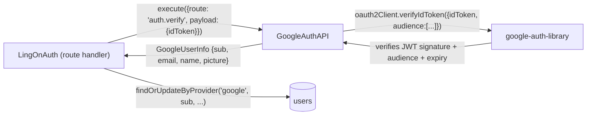

# `GoogleAuthAPI`

Source: [src/gateway/GoogleAuthAPI.ts](../../../src/gateway/GoogleAuthAPI.ts)

## Role

Google ID Token verifier using the `google-auth-library` SDK.  
Extends `BaseProvider` (not `BaseGateway`) — it uses the SDK's `OAuth2Client`
internally rather than raw `fetch`, so `BaseGateway`'s HTTP helpers do not apply.

- `name`: `'google-auth'`
- Audiences: one or both of `GOOGLE_CLIENT_ID` (web) and
  `GOOGLE_ANDROID_CLIENT_ID` (Android) — at least one must be set (constructor
  throws `Error` if the audience array is empty).
- Multi-audience: a single token from either client ID is accepted. Both are
  passed as an array to `oauth2Client.verifyIdToken({ audience: [...] })`, so
  web and Android tokens are verified by the same instance.

## Input

`execute(input: ProviderRequest)` where `input.route` is:

| Route | Handler | Description |
|---|---|---|
| `auth.verify` | `verifyToken` | Verifies a Google `id_token`; returns `GoogleUserInfo` |

Unknown routes throw `AppError('OP_NOT_SUPPORTED', 400)`.

`payload` for `auth.verify`: `{ idToken: string }`.

## Output

`GoogleUserInfo`:

| Field | Source (Google payload) |
|---|---|
| `sub` | `payload.sub` |
| `email` | `payload.email` |
| `name` | `payload.name` |
| `picture` | `payload.picture` |

> **정정 2026-07-22**: 이 문구는 오래된 내용이었다 — 실제 필드명은
> `avatar_url`이 아니라 **`profile_image`**다. 근거: [api/auth.md](../api/auth.md),
> [api/users.md](../api/users.md), [database/users.md](../database/users.md)
> (DB 컬럼명도 `profile_image`), [frontend/docs/services/AuthService.md](../../../frontend/docs/services/AuthService.md)의
> API 필드명 변경 안내(`avatar_url` → `profile_image`)가 전부 일치한다. route
> 계층은 `picture` → `profile_image`로 rename한다. `picture`는 어떤 HTTP
> 응답에도 노출되지 않는다.

## Security

- The raw `id_token` is **never logged** — only `sub` is emitted after
  successful verification.
- Token failures throw `AppError('UNAUTHORIZED', 401)` (wrapping the
  `google-auth-library` error, not forwarding its message to the client).

## Call relationships



## Dependencies

- `BaseProvider` — abstract base (`readonly name`, `execute` interface)
- `OAuth2Client` from `google-auth-library` — token verification SDK
- `AppError` — thrown on verification failure and unsupported routes
- No DB access — `userRepository` is called by the route handler, not this gateway

## Instantiation

One instance is created per registration of the `LingOnAuth` route plugin
(in `src/route/LingOnAuth.ts`'s plugin entry point):

```typescript
const audiences = [app.config.GOOGLE_CLIENT_ID, app.config.GOOGLE_ANDROID_CLIENT_ID]
  .filter(id => id.length > 0);
const oauth2Client = new OAuth2Client();
const googleAuth = new GoogleAuthAPI(oauth2Client, audiences, app.log);
```
