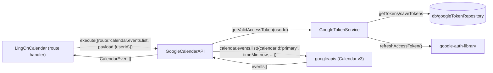

# `GoogleCalendarAPI` + `GoogleTokenService`

Sources:
- [src/gateway/GoogleCalendarAPI.ts](../../../src/gateway/GoogleCalendarAPI.ts)
- [src/gateway/GoogleTokenService.ts](../../../src/gateway/GoogleTokenService.ts)

## Role

`GoogleCalendarAPI` — read-only Google Calendar client using the `googleapis`
SDK. Extends `BaseProvider` (not `BaseGateway`) — same reasoning as
`GoogleAuthAPI`: it delegates to an SDK, not raw `fetch`.

- `name`: `'google-calendar'`
- Depends on `GoogleTokenService` to resolve a valid access token per call —
  never reads `googleTokenRepository` directly.

`GoogleTokenService` — resolves a valid Google Calendar access token for a
user, refreshing it via the stored refresh token when expired (or within 60s
of expiring). Not a `BaseProvider`; a plain helper class injected into
`GoogleCalendarAPI`.

Both are completely independent of `GoogleAuthAPI` (login id_token
verification) — neither is invoked during login, and `GoogleAuthAPI` is never
invoked here.

## Input

`GoogleCalendarAPI.execute(input: ProviderRequest)` where `input.route` is:

| Route | Handler | Description |
|---|---|---|
| `calendar.events.list` | `listUpcomingEvents` | Lists events from `primary` calendar, today onward |

Unknown routes throw `AppError('OP_NOT_SUPPORTED', 400)`.

`payload` for `calendar.events.list`: `{ userId: string }`.

## Output

`CalendarEvent[]`:

| Field | Source (Google Calendar API `event`) |
|---|---|
| `id` | `event.id` |
| `summary` | `event.summary` |
| `description` | `event.description` |
| `location` | `event.location` |
| `start` | `event.start.dateTime ?? event.start.date` |
| `end` | `event.end.dateTime ?? event.end.date` |
| `allDay` | `true` when `event.start.date` is set and `event.start.dateTime` is not |
| `htmlLink` | `event.htmlLink` |

## `GoogleTokenService.getValidAccessToken(userId)`

```
googleTokenRepo.getTokens(userId)          // decrypts stored access/refresh token
  → null                                    → throw AppError('CALENDAR_NOT_CONNECTED', 403)
  → access token expires > 60s from now     → return stored access token as-is
  → otherwise:
      oauth2Client.setCredentials({ refresh_token })
      oauth2Client.refreshAccessToken()      // google-auth-library
        → failure                            → throw AppError('CALENDAR_TOKEN_REFRESH_FAILED', 502)
        → success                            → googleTokenRepo.saveTokens(userId, newAccessToken, newRefreshToken?, newExpiry)
                                              → return newAccessToken
```

Google does not always re-issue a `refresh_token` on refresh; `saveTokens` is
called with `refreshToken: undefined` in that case, which leaves the existing
stored refresh token untouched (see
[db/googleTokenRepository.ts](../../../src/db/googleTokenRepository.ts)).

## Security

- Access/refresh tokens are decrypted only in-process, immediately before use,
  and are never logged (`this.logger.debug`/`.info` calls log `userId` and
  counts only — never token values).
- A refreshed token is persisted (encrypted) **before** being returned to the
  caller — if the DB write fails, the request fails rather than using an
  unpersisted token that the next call would try to refresh again from a
  stale refresh token.

## Call relationships



## Dependencies

- `BaseProvider` — abstract base (`readonly name`, `execute` interface)
- `googleapis` (`google.calendar('v3')`) — Calendar API client
- `google-auth-library` (`OAuth2Client`) — used by `GoogleTokenService` for token refresh, and to attach the resolved access token via `setCredentials` before each Calendar call
- `AppError` — thrown on unsupported routes, missing connection, and refresh/API failures
- `googleTokenRepository` — read/write access to encrypted tokens (via `GoogleTokenService` only; `GoogleCalendarAPI` never imports it directly)

## Instantiation

One instance of each is created per registration of the `LingOnCalendar`
route plugin (`src/route/LingOnCalendar.ts`'s plugin entry point):

```typescript
const tokenService = new GoogleTokenService(
  app.config.GOOGLE_CLIENT_ID,
  app.config.GOOGLE_CLIENT_SECRET,
  app.log
);
const gateway = new GoogleCalendarAPI(tokenService, app.log);
```
