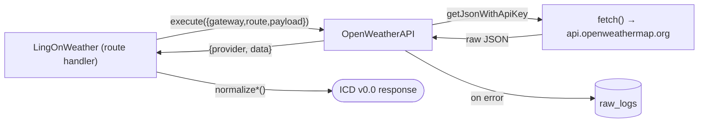

# `OpenWeatherAPI`

Source: [src/gateway/OpenWeatherAPI.ts](../../../src/gateway/OpenWeatherAPI.ts)

## Role

HTTP client for [OpenWeather](https://openweathermap.org/api) — current
weather, 5-day forecast, forward and reverse geocoding. The only concrete
`BaseGateway` subclass in the codebase today.

- `name`: `'openweather'`
- Default base URL: `https://api.openweathermap.org` (overridable via
  `deps.baseUrl`, wired from `OPENWEATHER_BASE_URL` env var)
- API key strategy: plain-text injection (`deps.apiKey`, from
  `OPENWEATHER_API_KEY` env var) — see [services/README.md](README.md) for
  the alternative `keyRepo + crypto` path this class doesn't currently use.

## Input

`execute(input: ProviderRequest)` where `input.route` is one of:

| Route | Handler | Upstream endpoint |
|---|---|---|
| `weather.current` | `fetchCurrentWeather` | `GET /data/2.5/weather` |
| `weather.forecast5` | `fetchForecast5` | `GET /data/2.5/forecast` |
| `geo.direct` | `geoDirect` | `GET /geo/1.0/direct` |
| `geo.reverse` | `geoReverse` | `GET /geo/1.0/reverse` |

Unknown routes throw `AppError('OP_NOT_SUPPORTED', 400)`.

## Output

Each handler returns the raw `httpGetJson` envelope:
`{ provider: 'openweather', ...meta, data: <parsed OWM JSON> }`. Route-layer
normalization into the ICD v0.0 shape happens in
[LingOnWeather.ts](../../../src/route/LingOnWeather.ts), documented in
[api/weather.md](../api/weather.md).

## Call relationships

## Dependencies

- `BaseGateway` (auth resolution, HTTP helper, logging, error wrapping)
- `AppError` (thrown for unsupported routes and validation failures)
- No DB access — this gateway only reads its API key from the env-injected
  `deps.apiKey`, not from `repos.providerKeys`.
