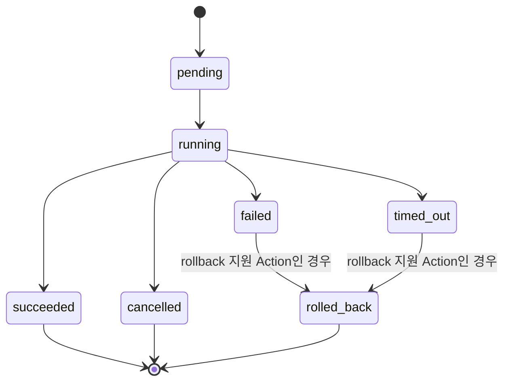

# Action Layer API (Proposal)

> **Status**: Proposed (미구현) · **Progress**: 0% · **Last Updated**: 2026-07-21 · **Next Milestone**: `POST /v1/actions/execute` 최소 스캐폴딩 — [requirements/action_requirements.md](../../requirements/action_requirements.md) ACT-001

개요/원칙은 [README.md](README.md)를 본다. 기존 API와의 관계는
[api_comparison.md](api_comparison.md)를 본다. 이 문서는 **API 구조 제안**이며,
실제 구현 문서(어떤 파일/함수가 이를 구현하는지)는 구현 착수 시
`backend/docs/routes`, `backend/docs/plugins`에 별도로 작성한다 — 이 문서에는
구현 코드를 적지 않는다.

## 버전/호환성 (2026-07-21 추가)

- 아래 모든 응답은 기존 백엔드가 이미 쓰고 있는 **ICD v0.0** 봉투
  (`{success, data, error}`, [backend/docs/DevelopmentGuide.md](../../backend/docs/DevelopmentGuide.md))를
  그대로 사용한다 — Action Layer가 새 봉투 포맷을 도입하지 않는다.
- `type`(Action Type)별 `input`/`result` 스키마는 이후 필드를 **추가**할 수는
  있어도, 기존 필드의 이름/타입을 변경하거나 제거하지 않는다(하위 호환).
  스키마를 깨는 변경이 꼭 필요하면 새 Action Type(`calendar.list_events.v2`
  형태)으로 추가하고 기존 것은 [api_comparison.md](api_comparison.md)에
  Deprecated로 표시한다 — 기존 값을 그 자리에서 바꾸지 않는다.
- State 이름의 단일 기준은 [requirements/domain_icd/action.md](../../requirements/domain_icd/action.md)이다(아래 State 섹션 참고).

---

## 핵심 개념

```
Natural Language → Intent → Action → Execution → Result
                              │
                              └─(다수인 경우)→ Workflow → Execution(steps[]) → Result
```

| 개념 | 정의 |
|---|---|
| **Intent** | 사용자 자연어 메시지를 분류한 구조([requirements/intent_requirements.md](../../requirements/intent_requirements.md))의 산출물. 하나의 Action 또는 Workflow로 연결된다. |
| **Action** | 실행 가능한 최소 단위(`type` + `input`). 예: `calendar.list_events`, `weather.get_current`, `home_assistant.toggle_entity`. |
| **Action Type** | Action의 namespace화된 식별자. `<domain>.<verb>` 형식(`calendar.create_event`). [GET /v1/actions/types](#get-v1actionstypes)로 조회 가능해야 한다(확장성 — Home Assistant/NAS 등 신규 도메인은 신규 엔드포인트 없이 신규 Action Type만 등록). |
| **Workflow** | 둘 이상의 Action을 의존성/조건과 함께 묶은 실행 계획([requirements/planner_requirements.md](../../requirements/planner_requirements.md) 산출물, Tier 4). |
| **Execution** | Action 또는 Workflow의 1회 실행 인스턴스. 상태 머신을 가진다(아래 State 섹션). |
| **Result** | Execution이 끝났을 때의 정규화된 출력. |

---

## Action API

### `POST /v1/actions/execute`

단일 Action을 실행한다.

**Request**

```jsonc
POST /v1/actions/execute
Authorization: Bearer <access_token>
Content-Type: application/json

{
  "type": "calendar.list_events",       // required — Action Type
  "input": { "range_days": 7 },          // required — Action Type별 입력 스키마를 따름
  "source": "chat",                      // required — "chat" | "api" | "automation" | "workflow"
  "intent_id": "intent_abc123"           // optional — Intent Layer가 생성한 추적 ID
}
```

**Response — 동기 완료 (200)**

```jsonc
{
  "success": true,
  "data": {
    "action_id": "act_01H...",
    "type": "calendar.list_events",
    "status": "succeeded",
    "result": { "events": [ /* ... */ ] },
    "started_at": "2026-07-21T00:00:00.000Z",
    "completed_at": "2026-07-21T00:00:01.200Z"
  },
  "error": null
}
```

**Response — 비동기 시작 (202)** (실행 시간이 긴 Action — 예: NAS 파일 스캔)

```jsonc
{ "success": true, "data": { "action_id": "act_01H...", "status": "running" }, "error": null }
```

이후 `GET /v1/actions/:id` 폴링 또는 `GET /v1/actions/:id/stream`(SSE) 구독.

**Error 응답**은 [에러 코드 레지스트리](#에러-코드-레지스트리) 참조.

---

### `GET /v1/actions/:id`

특정 Action Execution의 현재 상태/결과를 조회한다(폴링용).

```jsonc
GET /v1/actions/act_01H...
Authorization: Bearer <access_token>
```

응답 스키마는 `POST /v1/actions/execute`의 `data`와 동일.

---

### `GET /v1/actions/:id/stream` (SSE)

실행 중인 Action의 진행 상황을 스트리밍한다(Chat 스트리밍 응답,
[requirements/chat_requirements.md](../../requirements/chat_requirements.md) CHAT-002의 백엔드 대응).

```
GET /v1/actions/act_01H.../stream
Accept: text/event-stream
Authorization: Bearer <access_token>
```

**Event 목록**은 [Event 모델](#event-모델) 참조.

---

### `GET /v1/actions/history`

사용자의 과거 Action 실행 이력(페이지네이션).

```
GET /v1/actions/history?limit=20&cursor=<opaque>&type=calendar.*&status=succeeded
Authorization: Bearer <access_token>
```

```jsonc
{
  "success": true,
  "data": {
    "items": [ /* ActionExecution[] — POST /v1/actions/execute의 data와 동일 shape */ ],
    "next_cursor": "eyJ..." // null이면 마지막 페이지
  },
  "error": null
}
```

Frontend의 새 **History** 화면([frontend_interaction_flow.md](frontend_interaction_flow.md))이
이 엔드포인트로 채워진다.

---

### `GET /v1/actions/suggestions`

AI Decision Layer([../strategy/architecture.md](../strategy/architecture.md) Layer 2)가
현재 Context(시간/날씨/캘린더/이력)를 근거로 제안하는 Action 목록.

```jsonc
{
  "success": true,
  "data": {
    "suggestions": [
      {
        "type": "calendar.create_event",
        "label": "내일 팀 회의 일정 잡기",
        "reason": "반복 패턴 감지: 매주 화요일 10시 팀 회의",
        "input_preview": { "title": "팀 회의", "start": "2026-07-22T10:00:00+09:00" }
      }
    ]
  },
  "error": null
}
```

---

### `GET /v1/actions/types`

사용 가능한 Action Type 카탈로그(확장성의 핵심 — 신규 커넥터는 여기 항목만
추가하면 된다).

> **정정 2026-07-22**: 이전 버전은 `connected: boolean`만 반환해
> [requirements/domain_icd/tool.md](../../requirements/domain_icd/tool.md)의
> `ToolConnection` 5-state(`not_connected/connecting/connected/expired/revoked`)를
> 표현할 수 없었다(예: `Expired`인지 `NotConnected`인지 API로 구분 불가). 아래처럼
> `connection_status`(5-state 원본)를 반환하고, `connected`는 그로부터 파생된
> 편의 필드(`connection_status === 'connected'`)로 유지한다.

```jsonc
{
  "success": true,
  "data": {
    "types": [
      {
        "type": "calendar.list_events",
        "domain": "calendar",
        "connector": "google_calendar",
        "connection_status": "connected", // tool.md ToolConnection 5-state
        "connected": true,                // connection_status === 'connected' 파생값
        "input_schema": { "range_days": "number?" }
      },
      {
        "type": "home_assistant.toggle_entity",
        "domain": "home_assistant",
        "connector": "home_assistant",
        "connection_status": "not_connected",
        "connected": false,
        "input_schema": { "entity_id": "string", "state": "'on' | 'off'" }
      }
    ]
  },
  "error": null
}
```

---

## Workflow API (Tier 4)

### `POST /v1/workflow`

재사용 가능한 Workflow 정의를 저장한다.

```jsonc
POST /v1/workflow
{
  "name": "출근 준비 브리핑",
  "steps": [
    { "id": "s1", "action_type": "weather.get_current", "input": {} },
    { "id": "s2", "action_type": "calendar.list_events", "input": { "range_days": 1 } },
    {
      "id": "s3", "action_type": "llm.summarize", "input": { "template": "brief" },
      "depends_on": ["s1", "s2"],
      "on_failure": "skip"
    }
  ]
}
```

```jsonc
{ "success": true, "data": { "workflow_id": "wf_01H...", "name": "출근 준비 브리핑" }, "error": null }
```

### `GET /v1/workflow`, `GET /v1/workflow/:id`

저장된 Workflow 정의 목록/단건 조회.

### `POST /v1/workflow/:id/execute`

저장된 Workflow를 실행한다.

### `POST /v1/workflow/execute`

정의를 저장하지 않고 즉석(ad-hoc) Workflow를 실행한다 — `steps`를 body에 인라인으로
전달(스키마는 `POST /v1/workflow`의 `steps`와 동일).

**Response**

```jsonc
{
  "success": true,
  "data": {
    "workflow_execution_id": "wfe_01H...",
    "status": "running",
    "steps": [
      { "id": "s1", "status": "succeeded", "result": { /* ... */ } },
      { "id": "s2", "status": "running" },
      { "id": "s3", "status": "pending" }
    ]
  },
  "error": null
}
```

### `GET /v1/workflow/executions/:id`

Workflow 실행 상태 폴링(Action의 `GET /v1/actions/:id`에 대응).

---

## State 모델

### ActionExecution 상태 머신

> **정정 2026-07-21**: 이 상태값의 단일 기준(canonical)은
> [requirements/domain_icd/action.md](../../requirements/domain_icd/action.md) State
> 섹션이다 — 이전 버전은 `cancelled`가 빠져 있어 Domain ICD와 어긋났다. 아래는
> 그 기준을 그대로 반영한 것이며, 두 문서가 다시 벌어지면 항상 domain_icd/action.md를
> 우선한다.



| 필드 | 타입 | 설명 |
|---|---|---|
| `action_id` | string | 고유 ID |
| `type` | string | Action Type |
| `status` | `pending\|running\|succeeded\|failed\|timed_out\|cancelled\|rolled_back` | 현재 상태 |
| `input` | object | 요청 입력(재현/재시도용으로 저장) |
| `result` | object \| null | 성공 시 결과 |
| `error` | `{code, message}` \| null | 실패 시 에러 |
| `source` | `chat\|api\|automation\|workflow` | 실행 트리거 출처 |
| `started_at` / `completed_at` | ISO datetime | — |

### WorkflowExecution 상태

`pending → running → (succeeded | partially_failed | failed)`, 각 step은
ActionExecution과 동일한 상태 머신을 개별적으로 가지며 `depends_on`으로
선행 조건을, `on_failure`(`retry\|skip\|abort\|rollback`)로 실패 정책을 표현한다.
[requirements/planner_requirements.md](../../requirements/planner_requirements.md) PLN-003(Conditional
Workflow), PLN-004(Retry), PLN-005(Rollback)에 대응한다.

### Frontend 신규 State (모듈)

기존 상태 관리 패턴은 [frontend/docs/state/Overview.md](../../frontend/docs/state/Overview.md)의
`BaseModule extends ChangeNotifier`를 그대로 따른다.

| 신규 모듈 | 책임 |
|---|---|
| `ActionModule` | 현재 진행 중인 Action/Workflow 실행 상태(진행률, 스트리밍 partial result) |
| `ActionHistoryModule` | `GET /v1/actions/history` 페이지네이션 상태 |
| `SuggestionModule` | `GET /v1/actions/suggestions` 결과, Dashboard/Chat 진입점에 노출 |

---

## Event 모델

현재 백엔드에는 SSE/WebSocket 등 스트리밍 전송 수단이 전혀 없다(신규 — [gap_analysis.md](gap_analysis.md) 참조).

| Event | 페이로드 | 발생 시점 |
|---|---|---|
| `action.started` | `{action_id, type}` | Execution이 `running`으로 전이 |
| `action.progress` | `{action_id, partial}` | 스트리밍 가능한 Action(예: `llm.chat_complete`)의 중간 출력 — [requirements/chat_requirements.md](../../requirements/chat_requirements.md) CHAT-002 |
| `action.completed` | `{action_id, result}` | `succeeded` 전이 |
| `action.failed` | `{action_id, error}` | `failed` 전이 |
| `workflow.step.started` / `workflow.step.completed` / `workflow.step.failed` | `{workflow_execution_id, step_id, ...}` | Workflow 개별 step 전이 |
| `workflow.completed` / `workflow.rolled_back` | `{workflow_execution_id, status}` | Workflow 전체 종료 |

---

## 에러 코드 레지스트리

기존 코드는 라우트마다 개별 정의되어 있었다(`backend/docs/api/*.md`에 흩어짐,
[gap_analysis.md](gap_analysis.md) 참조). Action Layer는 기존 코드를 그대로
재사용하고, Action 전용 코드를 추가한다.

| Code | HTTP | 출처 | 설명 |
|---|---|---|---|
| `ACTION_TYPE_UNKNOWN` | 404 | 신규 | 등록되지 않은 `type` |
| `ACTION_VALIDATION_FAILED` | 400 | 신규 | `input`이 Action Type 스키마를 만족하지 않음 |
| `ACTION_CONNECTOR_NOT_CONNECTED` | 403 | 신규(`CALENDAR_NOT_CONNECTED` 일반화) | 실행에 필요한 커넥터 미연결 |
| `ACTION_EXECUTION_FAILED` | 500/502 | 신규(`PROVIDER_HTTP_ERROR` 일반화) | 실행 중 내부/제공자 오류 |
| `ACTION_TIMEOUT` | 504 | 신규 | 실행 시간 초과 |
| `WORKFLOW_NOT_FOUND` | 404 | 신규 | 존재하지 않는 workflow id |
| `WORKFLOW_STEP_FAILED` | 500 | 신규 | 특정 step 실패로 전체 실패 |
| `BAD_REQUEST` | 400 | 기존([auth.md](../../backend/docs/api/auth.md) 등) | 공통 |
| `UNAUTHORIZED` | 401 | 기존 | 공통 |
| `NOT_IMPLEMENTED` | 501 | 기존([auth.md](../../backend/docs/api/auth.md)) | 커넥터 미설정 |

---

## 확장성 — MVP 이후 도메인

`type` namespace만 추가하면 새 엔드포인트 없이 확장된다(모두 [../roadmap/mvp.md](../roadmap/mvp.md) 참조):

| 도메인 | Tier | 예시 Action Type |
|---|---|---|
| Calendar / Todo / Reminder | Tier 1 | `calendar.*`, `todo.create`, `reminder.create` |
| Home Assistant | Tier 2 | `home_assistant.toggle_entity`, `home_assistant.get_state` |
| NAS / Server Monitoring | Tier 3 | `nas.list_files`, `server.get_status` |
| Workflow | Tier 4 | (전용 API, 위 참조) |

---

# Change Log

- **2026-07-21** — Action Layer 전략에 따라 신규 작성(Created according to Action Layer Strategy).
