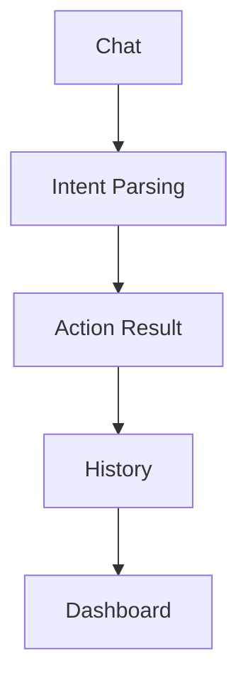

# Frontend Interaction Flow (Proposal)

> **Status**: Proposed (미구현) · **Progress**: 0% · **Last Updated**: 2026-07-21 · **Next Milestone**: Action Result 카드 UI 와이어프레임 — Tier 0 병행

API 대응은 [action_layer_api.md](action_layer_api.md)를 본다. 현재 실제 구현된
화면 구조는 [frontend/docs/ui/AodDisplay.md](../../frontend/docs/ui/AodDisplay.md)를 본다 —
이 문서는 그 구현을 대체하는 지시가 아니라, 향후 방향에 대한 제안이다.

---

## 왜 바꾸는가

현재 구현(`AodDisplay`)은 Dashboard 3컬럼 레이아웃이 항상 먼저 보이고, Chat은
그 레이아웃 중 한 칸(중앙 하단, flex 55)일 뿐이다. 새 전략에서 **Dashboard는
항상 마지막**이어야 한다([../strategy/product.md](../strategy/product.md) Core
Philosophy) — Chat(자연어 입력)이 1차 상호작용 표면이고, Dashboard는 그 결과로
쌓인 상태를 보여주는 뷰다.

## 제안 흐름

| 단계 | 화면/상태 | 신규/기존 | 대응 |
|---|---|---|---|
| Chat | 자연어 입력 | 기존(`ChatWidget`, `ChatModule`) 재사용 | [frontend/docs/widgets/ChatWidget.md](../../frontend/docs/widgets/ChatWidget.md) |
| Intent Parsing | "이렇게 이해했어요" 확인 카드 | **신규** | [requirements/intent_requirements.md](../../requirements/intent_requirements.md) 산출물을 표시 |
| Action Result | 실행 상태(progress) + 결과 카드 | **신규** — `ActionModule` | [action_layer_api.md](action_layer_api.md) `POST /v1/actions/execute`, SSE 이벤트 |
| History | 과거 Action 실행 로그 리스트 | **신규** — `ActionHistoryModule` | [action_layer_api.md](action_layer_api.md) `GET /v1/actions/history` |
| Dashboard | 현재 상태 시각화(Clock/Weather/Calendar/Status) | 기존, **위치만 마지막으로 이동** | [frontend/docs/ui/AodDisplay.md](../../frontend/docs/ui/AodDisplay.md) |

## Chat → Intent Parsing

사용자가 메시지를 보내면, 현재는 즉시 LLM 응답 버블만 나온다
([frontend/docs/services/LlmService.md](../../frontend/docs/services/LlmService.md)).
새 흐름에서는 먼저 파싱된 Intent를 짧게 되짚어 보여준다(예: "캘린더에 '팀 회의'
일정을 내일 10시에 추가할까요?") — 사용자가 확인/취소할 수 있는 지점.
Intent Layer가 없는 현재는 이 단계를 생략하고 Chat → Action Result로 바로 갈 수
있으나(Tier 0 최소 구현), 인터페이스(State: `pending_intent`)는 처음부터
Intent Parsing 단계를 위한 자리로 설계한다.

## Intent Parsing → Action Result

확인 즉시(또는 자동 확신도 임계치 이상이면 자동으로) `POST /v1/actions/execute`
호출. `ActionModule`이 `action.progress`/`action.completed` 이벤트를 구독해
카드 UI를 갱신한다(스트리밍 — [action_layer_api.md](action_layer_api.md) Event 모델).

## Action Result → History

완료된 Action은 자동으로 History 목록에 쌓인다. 별도 "저장" 동작이 필요 없다 —
백엔드가 모든 Action 실행을 `action_executions`에 기록하므로([gap_analysis.md](gap_analysis.md)
신규 테이블), History 화면은 `GET /v1/actions/history`를 그대로 렌더링한다.

## History → Dashboard

History에서 Dashboard로 넘어가는 것은 "다음 액션"이 아니라 "현재 상태 확인"으로의
전환이다. Dashboard 위젯 자체는 변경하지 않는다([requirements/dashboard_requirements.md](../../requirements/dashboard_requirements.md)) —
다만 앱의 **기본 진입 화면**은 더 이상 Dashboard가 아니라 Chat이 되어야 한다는
것이 이 문서의 핵심 제안이다.

## 영향받는 기존 문서 (검토 결과)

| 기존 문서 | 검토 결과 |
|---|---|
| [frontend/docs/ui/AodDisplay.md](../../frontend/docs/ui/AodDisplay.md) | Dashboard가 유일한 메인 화면 — 신규 전략과 진입점이 어긋남. 문서 상단에 검토 배너 추가함(삭제 없음). |
| [frontend/docs/ui/BootstrapScreen.md](../../frontend/docs/ui/BootstrapScreen.md) | 세션 복원 후 바로 `AodDisplay`로 진입 — Chat-first 진입으로 바뀌면 라우팅 대상 재검토 필요. |
| [frontend/docs/services/LlmService.md](../../frontend/docs/services/LlmService.md) | 클라이언트가 OpenAI를 직접 호출 — Action Layer 도입 시 `POST /v1/actions/execute {type: "llm.chat_complete"}` 경유로 대체 예정(Deprecated 표시함). |
| [frontend/docs/state/Overview.md](../../frontend/docs/state/Overview.md) | `BaseModule` 패턴은 그대로 재사용 가능 — 신규 모듈(`ActionModule` 등) 추가만 필요. |

## 관련 문서

- [README.md](README.md), [action_layer_api.md](action_layer_api.md)
- [../../requirements/chat_requirements.md](../../requirements/chat_requirements.md), [dashboard_requirements.md](../../requirements/dashboard_requirements.md)

---

# Change Log

- **2026-07-21** — Action Layer 전략에 따라 신규 작성(Created according to Action Layer Strategy).
