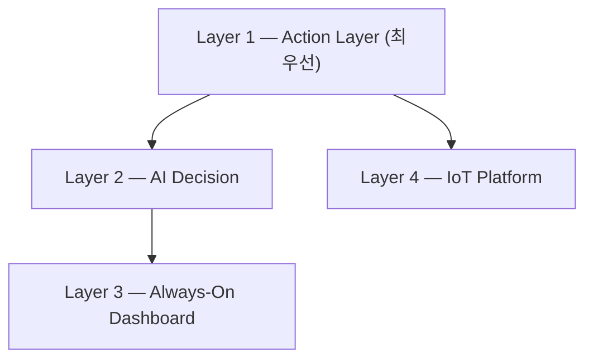

# Product Architecture (Layers)

> **Status**: Adopted · **Last Updated**: 2026-07-21

이 문서는 제품이 **왜 이 4개의 계층으로 나뉘는지, 각 계층이 왜 그 우선순위를
갖는지**를 정의한다. 각 계층의 실제 구현 상세(How)는 옆에 링크된
`backend/docs`, `frontend/docs`, `requirements/` 문서를 본다 — 이 문서 자체에는
구현 코드나 API를 적지 않는다.

---

## 제품 계층



### Layer 1 — Action Layer (최우선)

```
Natural Language → Intent → Tool Router → Execution
```

제품의 본질([product.md](product.md) 참조). 사용자의 자연어를 실제 실행 가능한
행동으로 옮기는 계층이며, 다른 모든 계층은 이 계층을 위해 존재한다.

| 하위 개념 | Requirement 문서 |
|---|---|
| Natural Language 입력 | [requirements/chat_requirements.md](../../requirements/chat_requirements.md) |
| Intent | [requirements/intent_requirements.md](../../requirements/intent_requirements.md) |
| Tool Router / Execution | [requirements/action_requirements.md](../../requirements/action_requirements.md) |

**현재 상태**: `requirements/system_requirements.md` 기준 Intent(SYS-004)·Action
Dispatch(ACT-001)는 0%(코드 없음). 백엔드는 라우트 단위 REST 처리만 있고
Tool Router 추상화가 없다 — [backend/docs/routes/README.md](../../backend/docs/routes/README.md).

### Layer 2 — AI Decision

```
Context(Location, Schedule, Weather, History) → Recommendation → Notification
```

사용자에게 먼저 다가가는 계층 — 물어보기 전에 맥락을 근거로 추천/알림을 만든다.

| 하위 개념 | Requirement 문서 |
|---|---|
| Context 수집(Memory/RAG) | [requirements/memory_requirements.md](../../requirements/memory_requirements.md) |
| Recommendation/Planning | [requirements/planner_requirements.md](../../requirements/planner_requirements.md) |
| AI Briefing(현재 유일한 근사 구현) | [requirements/system_requirements.md](../../requirements/system_requirements.md) SYS-003, [frontend/docs/widgets/BriefCardWidget.md](../../frontend/docs/widgets/BriefCardWidget.md) |

**현재 상태**: Memory/Planner는 0%. `BriefCardWidget`이 날씨+캘린더로 브리핑
텍스트를 만드는 것이 유일하게 이 계층의 목적에 근접한 기능이지만, 서버측
Context 저장/추천/알림 파이프라인은 없다.

### Layer 3 — Always-On Dashboard

Dashboard에는 **비즈니스 로직을 넣지 않는다**. 상태를 보여주는 역할만 한다.

| 하위 개념 | Requirement 문서 |
|---|---|
| Dashboard 전체 | [requirements/dashboard_requirements.md](../../requirements/dashboard_requirements.md) |
| 실제 화면 구현 | [frontend/docs/ui/AodDisplay.md](../../frontend/docs/ui/AodDisplay.md) |

**현재 상태**: 이 계층이 4개 Layer 중 **가장 많이 구현되어 있다** (Clock/Weather/Calendar/Chat/Brief/Status
위젯, 대부분 75% 수준). 우선순위상 마지막(3번째) Layer이지만 실제로는 가장
먼저 만들어졌다 — [../decisions/architecture_decisions.md](../decisions/architecture_decisions.md)의
"Dashboard는 MVP가 아니다" 결정은 이 격차를 바로잡기 위한 것이다.

### Layer 4 — IoT Platform

현재: Home Assistant, Matter, MQTT.
향후: SmartThings, Apple Home, Google Home 지원.

| 하위 개념 | Requirement 문서 |
|---|---|
| 커넥터 전체 | [requirements/connector_requirements.md](../../requirements/connector_requirements.md) |

**현재 상태**: Google Calendar 커넥터만 백엔드 쪽이 구현되어 있고(프론트 미연동),
Home Assistant는 UI 스텁만 있으며, Matter/MQTT/SmartThings/Apple Home/Google Home은
근거가 전혀 없다(0%).

---

## Layer 간 우선순위

```
Layer 1 (Action) > Layer 2 (AI Decision) > Layer 4 (IoT, 커넥터 확장) > Layer 3 (Dashboard)
```

Layer 3(Dashboard)은 아키텍처 다이어그램상 3번째 위치이지만, 이는 **사용자에게
보이는 순서**일 뿐 **개발 우선순위**가 아니다. 개발 우선순위는
[../development_rules.md](../development_rules.md)의 9번 규칙(Action Layer → AI
Decision → Integrations → Dashboard → UI Polish)을 따른다.

## 관련 문서

- [product.md](product.md), [positioning.md](positioning.md), [competitors.md](competitors.md)
- [../roadmap/roadmap.md](../roadmap/roadmap.md) — 이 Layer 우선순위를 시간순 계획으로 변환
- [../../requirements/README.md](../../requirements/README.md) — Layer ↔ Requirement 문서 매핑 규칙
