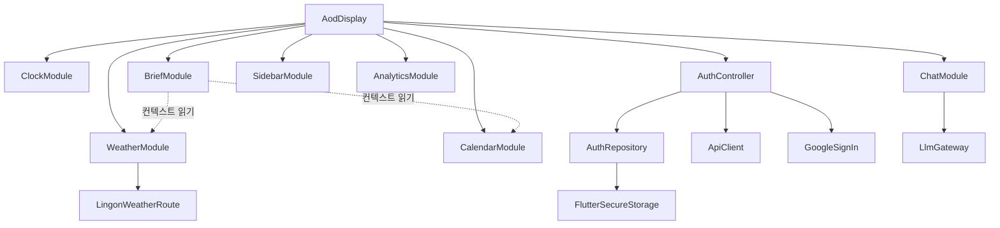
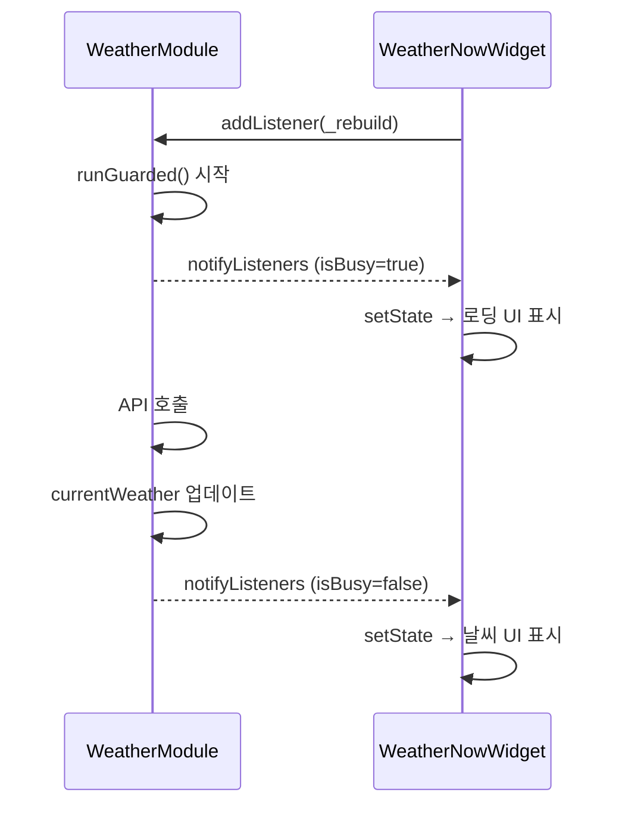

# State Management Overview

> 외부 상태 관리 패키지(Provider, Riverpod, Bloc 등)를 사용하지 않습니다.  
> 모든 상태는 커스텀 `BaseModule extends ChangeNotifier` 패턴으로 관리됩니다.
>
> **⚠ 2026-07-21 전략 검토 (Action Layer)**: 아래 모듈 구조는 변경되지 않는다.
> Action Layer 도입 시 동일한 `BaseModule` 패턴으로 `ActionModule`,
> `ActionHistoryModule`, `SuggestionModule`이 추가될 것으로 제안된다 — 설계:
> [../../../docs/icd/action_layer_api.md](../../../docs/icd/action_layer_api.md) State 섹션.

---

## 상태 관리 방식

### BaseModule 패턴

```dart
// 모든 기능 모듈의 기반 클래스
class BaseModule extends ChangeNotifier {
  bool _isBusy = false;
  bool _hasError = false;
  String? _errorMessage;

  // 비동기 작업 래퍼 — isBusy 자동 관리, 예외 자동 캡처
  Future<T?> runGuarded<T>(Future<T> Function() action) { ... }

  // 게이트웨이 resolve
  T gw<T>() => BaseGateway.resolve<T>();
}
```

### 위젯 구독 패턴

```dart
@override
void initState() {
  super.initState();
  widget.module.addListener(_rebuild);
}

@override
void dispose() {
  widget.module.removeListener(_rebuild);
  super.dispose();
}

void _rebuild() {
  if (mounted) setState(() {});
}
```

---

## 모듈 의존 관계



---

## 모듈별 상태 요약

| 모듈 | 주요 상태 | `isBusy` 의미 |
|------|-----------|---------------|
| `ClockModule` | `DateTime now` | — (항상 false) |
| `WeatherModule` | `currentWeather`, `forecast` | API 호출 중 |
| `CalendarModule` | `List<CalendarEvent>` | 캘린더 로드 중 |
| `BriefModule` | `String? briefText` | AI 생성 중 |
| `ChatModule` | `List<ChatMessage>` | LLM 응답 대기 (타이핑 인디케이터) |
| `SidebarModule` | 설정값 (volume, brightness 등) | — |
| `AnalyticsModule` | 카운터 | — |
| `AuthController` | `isAuthenticated`, `currentUser`, `error` | 로그인 처리 중 |

---

## 상태 흐름 예시 — 날씨 갱신



---

## 상태 영속성 현황

| 모듈 | 영속성 | 방법 |
|------|--------|------|
| `AuthController` | ✅ | `flutter_secure_storage` (access_token, refresh_token) |
| `SidebarModule` | ❌ | 앱 재시작 시 초기화됨 (TODO: `shared_preferences` 연결) |
| 그 외 모듈 | ❌ | 모두 메모리 상태 |
