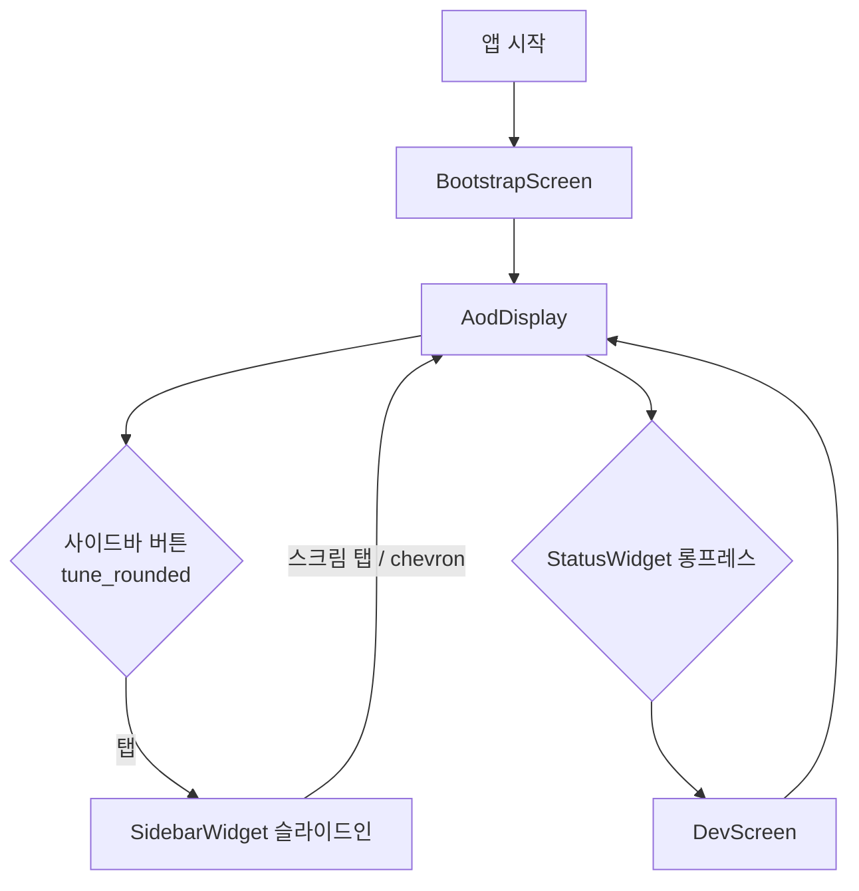

# AodDisplay

`lib/screen/aod_display.dart`

---

> **⚠ 2026-07-21 전략 검토 (Action Layer) — 화면 흐름 재검토 대상**: Personal
> Action OS 전략에서 Dashboard는 항상 마지막 화면이어야 한다
> ([../../../docs/strategy/product.md](../../../docs/strategy/product.md) Core
> Philosophy). 이 화면(`AodDisplay`)이 현재 앱의 유일한 메인 화면이라는 구조는
> 그 전략과 어긋난다 — 위젯/레이아웃 자체는 변경하지 않으며, 진입 순서(Chat →
> Intent Parsing → Action Result → History → Dashboard) 제안은
> [../../../docs/icd/frontend_interaction_flow.md](../../../docs/icd/frontend_interaction_flow.md) 참조.

## 목적

앱의 메인 AOD(Always-On Display) 화면입니다. 모든 기능 모듈의 생명주기를 소유하고, 3컬럼 태블릿 레이아웃에 위젯을 배치합니다.

---

## 레이아웃

```
┌── LEFT 28% ──────────┐  ┌── CENTER 44% ──────────────┐  ┌── RIGHT 28% ──┐
│  ClockWidget         │  │  CalendarWidget  (flex 35)  │  │  Forecast     │
│  WeatherNowWidget    │  │  ─────────────────────────  │  │  Widget       │
│  BriefCardWidget     │  │  ChatWidget      (flex 55)  │  │  (expand)     │
│  (expand)            │  └─────────────────────────────┘  │  StatusWidget │
└──────────────────────┘                                    └───────────────┘

SidebarWidget ─ AnimatedPositioned, 300px, 오른쪽 슬라이드인
```

---

## 주요 Widget

| 위젯 | 위치 | 연결 모듈 |
|------|------|-----------|
| `ClockWidget` | 좌측 상단 | `ClockModule` |
| `WeatherNowWidget` | 좌측 중단 | `WeatherModule` |
| `BriefCardWidget` | 좌측 하단 (expand) | `BriefModule`, `WeatherModule`, `CalendarModule` |
| `CalendarWidget` | 중앙 상단 (flex 35) | `CalendarModule` |
| `ChatWidget` | 중앙 하단 (flex 55) | `ChatModule` |
| `WeatherForecastWidget` | 우측 상단 (expand) | `WeatherModule` |
| `StatusWidget` | 우측 하단 | — |
| `SidebarWidget` | 오른쪽 오버레이 | `SidebarModule`, `AuthController` |

---

## 상태 (State)

`_AodDisplayState`가 소유하는 필드:

| 필드 | 타입 | 설명 |
|------|------|------|
| `_auth` | `AuthController` | Google 인증, `restoreSession()` 자동 실행 |
| `_clock` | `ClockModule` | 1초 틱 타이머 |
| `_weather` | `WeatherModule` | 현재 날씨 + 예보 |
| `_calendar` | `CalendarModule` | 로컬 이벤트 |
| `_brief` | `BriefModule` | AI 브리핑 |
| `_chat` | `ChatModule` | 채팅 스레드 |
| `_sidebar` | `SidebarModule` | 설정 저장 |
| `_analytics` | `AnalyticsModule` | 사용 추적 |
| `_sidebarOpen` | `bool` | 사이드바 열림 여부 |

---

## 사용자 흐름



---

## 호출 API

직접 호출하지 않습니다. 각 모듈이 내부적으로 API를 호출합니다.

- 날씨: `WeatherModule` → `LingonWeatherRoute` → `./docs/api` 참조
- 인증: `AuthController` → `AuthRepository` → `/v1/auth/google` → `./docs/api` 참조

---

## 관련 모델

- `UserModel` — 로그인 사용자 정보
- `WeatherData` — 현재 날씨 데이터
- `CalendarEvent` — 캘린더 이벤트
