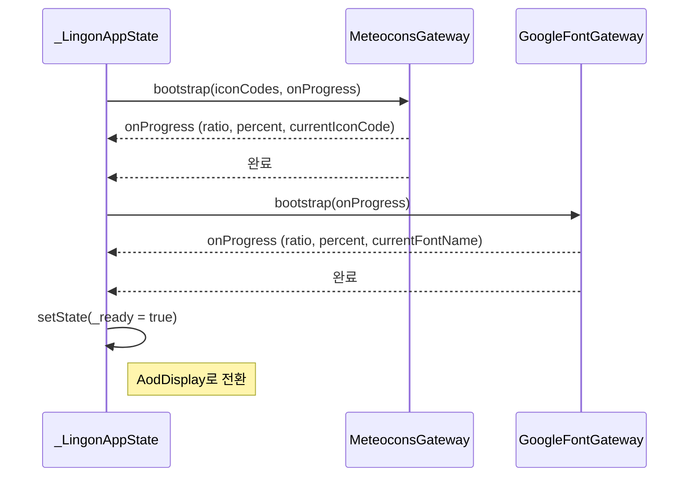

# BootstrapScreen

`lib/screen/bootstrap_screen.dart`

---

## 목적

앱 시작 시 SVG 아이콘과 폰트를 프리로드하는 로딩 화면입니다. 완료되면 `AodDisplay`로 전환됩니다.

---

## 주요 Widget

- 진행 상황 텍스트 (`label`)
- 현재 로드 중인 항목 (`currentItem`)
- 진행률 표시 (`ratio`, `percent`)
- 오류 시 재시도 버튼

---

## 상태 (State)

`_LingonAppState`가 관리합니다 (`main.dart`).

| 필드 | 타입 | 설명 |
|------|------|------|
| `_bootstrapLabel` | `String` | 현재 단계 텍스트 |
| `_bootstrapItem` | `String?` | 현재 로드 중인 아이콘/폰트 이름 |
| `_bootstrapRatio` | `double` | 0.0~1.0 진행률 |
| `_bootstrapPercent` | `int` | 0~100 퍼센트 |
| `_error` | `Object?` | 오류 발생 시 |
| `_ready` | `bool` | 완료 여부 |

---

## 부트스트랩 순서

---

## 호출 API

없음. 로컬 파일 및 네트워크 폰트만 로드합니다.

---

## 관련 모델

없음.
