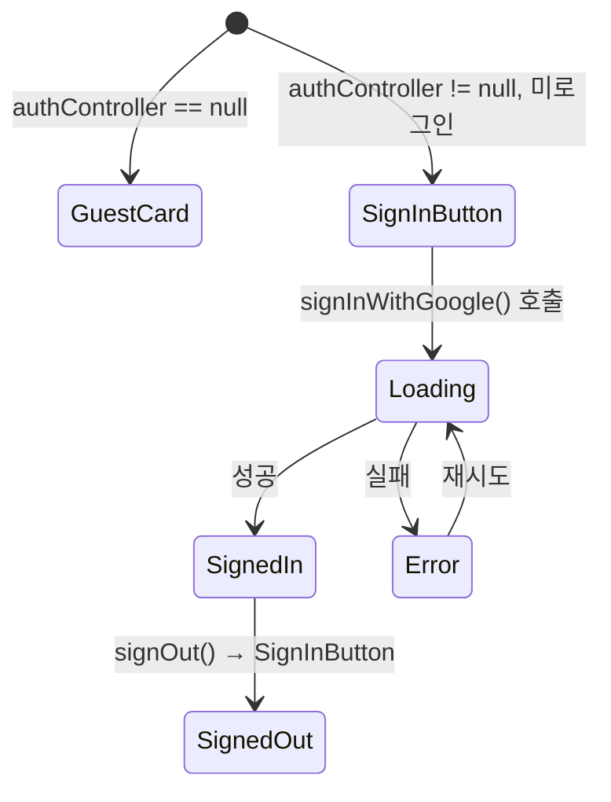

# SidebarWidget

`lib/widget/sidebar_widget.dart`

---

## 역할

오른쪽에서 슬라이드인하는 설정 패널입니다. 사용자 인증, 테마 토글, 볼륨·밝기·날씨 설정을 담습니다.

---

## 입력 (Props)

| 파라미터 | 타입 | 필수 | 설명 |
|----------|------|------|------|
| `module` | `SidebarModule` | ✅ | 설정값 저장 소스 |
| `themeMode` | `ThemeMode` | ✅ | 현재 테마 — 강조 pill 결정 |
| `onSetTheme` | `ValueChanged<ThemeMode>` | ✅ | 테마 변경 요청 콜백 |
| `cityName` | `String?` | — | WeatherModule에서 주입된 도시명 |
| `onClose` | `VoidCallback?` | — | chevron 탭으로 닫기 |
| `authController` | `AuthController?` | — | Google 인증 패널 활성화 |

---

## 출력 (Callbacks)

| 콜백 | 시점 |
|------|------|
| `onSetTheme(mode)` | 다크/라이트/시스템 pill 탭 |
| `onClose()` | chevron_right 버튼 탭 |

---

## 사용자 카드 상태

---

## 사용 위치

- `AodDisplay` → `AodTabletLayout.sidebar`

---

## 의존성

| 대상 | 타입 |
|------|------|
| `SidebarModule` | `BaseModule` |
| `AuthController` | `ChangeNotifier` (선택) |
