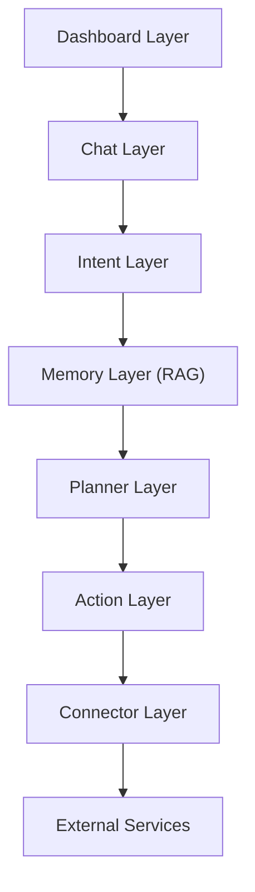

# Requirements

> 이 문서가 정의하는 개발 절차(How to write Requirements)보다 상위의 제품
> 우선순위("왜 이 순서로 만드는가")는 [../docs/development_rules.md](../docs/development_rules.md)와
> [../docs/strategy/product.md](../docs/strategy/product.md)를 따른다. 새 기능을
> 검토할 때는 그 문서들을 먼저 확인한다.

LetMeKnow는 AI 기반 **Personal Action OS**이다. Dashboard는 단순한 UI이며,
사용자는 자연어로 자신의 의도를 전달하고, LLM이 Intent를 생성한 뒤, Planner와
Action Router가 실제 서비스를 실행한다.

앞으로 모든 개발은 **Requirements Driven Development(RDD)**를 따른다: 구현에
앞서 이 디렉터리에 Requirement를 먼저 정의하고, 구현/테스트 이후에만 실제
확인된 근거를 바탕으로 Status와 Progress를 갱신한다.

이 디렉터리는 `backend/docs`, `frontend/docs`의 구현 문서 구조를 그대로 둔 채,
그 위에 걸쳐 있는 **시스템 전체(System-wide) Requirement**만 관리한다.
Backend/Frontend 각각의 구현 세부사항은 계속 `backend/docs`, `frontend/docs`를
참조한다.

---

## Architecture



| Layer | Requirement 문서 | Parent System Requirement |
|---|---|---|
| Dashboard | [dashboard_requirements.md](dashboard_requirements.md) | SYS-001 |
| Chat | [chat_requirements.md](chat_requirements.md) | SYS-002 |
| Intent | [intent_requirements.md](intent_requirements.md) | SYS-004 |
| Memory (RAG) | [memory_requirements.md](memory_requirements.md) | SYS-005 |
| Planner | [planner_requirements.md](planner_requirements.md) | SYS-009 |
| Action | [action_requirements.md](action_requirements.md) | SYS-006 |
| Connector | [connector_requirements.md](connector_requirements.md) | SYS-007 |
| LLM Gateway | [llm_gateway_requirements.md](llm_gateway_requirements.md) | SYS-010 |

System Requirement 전체 목록(SYS-001~SYS-010)은 [system_requirements.md](system_requirements.md)에 있다.
전체 추적 매트릭스는 [requirements_traceability.md](requirements_traceability.md)에 있다.

---

## Domain ICD (API보다 상위 계층)

[domain_icd/](domain_icd/)는 REST API/Flutter State/DB Schema보다 상위에서
**비즈니스 도메인 간 계약(Contract)**을 정의한다 — Backend/Frontend는 API가
아니라 이 Domain ICD를 기준으로 구현하며, API는 그 구현 수단일 뿐이다.
Requirement를 작성하기 전에 해당 기능이 어느 Domain에 속하는지 먼저
[domain_icd/README.md](domain_icd/README.md)에서 확인한다.

```
docs/strategy/         → 왜 (제품 전략)
requirements/domain_icd/ → 무엇의 계약을 지켜야 하는가 (Domain ICD)
requirements/*_requirements.md → 무엇을 (Requirement, RDD)
docs/icd/, backend/docs, frontend/docs → 어떻게 (API/구현)
```

---

## Requirement 문서 목록

| 문서 | 내용 |
|---|---|
| [domain_icd/](domain_icd/) | Domain ICD — 비즈니스 도메인 계약(Action/Workflow/Tool/Calendar/... 11종). Requirement보다 상위 |
| [system_requirements.md](system_requirements.md) | 최상위 System Requirement (SYS-001~SYS-010) |
| [dashboard_requirements.md](dashboard_requirements.md) | Dashboard Layer (DSH-xxx) |
| [chat_requirements.md](chat_requirements.md) | Chat Layer (CHAT-xxx) |
| [intent_requirements.md](intent_requirements.md) | Intent Layer (INT-xxx) |
| [memory_requirements.md](memory_requirements.md) | Memory Layer (MEM-xxx) |
| [planner_requirements.md](planner_requirements.md) | Planner Layer (PLN-xxx) |
| [action_requirements.md](action_requirements.md) | Action Layer (ACT-xxx) |
| [connector_requirements.md](connector_requirements.md) | Connector Layer (CON-xxx) |
| [llm_gateway_requirements.md](llm_gateway_requirements.md) | LLM Gateway (LLM-xxx) |
| [requirements_traceability.md](requirements_traceability.md) | Business Goal → System → Layer → 구현 파일 → Verification 추적 |

---

## Requirement Table 형식

모든 Requirement 문서는 아래 표 형식을 사용한다.

| ID | Parent Feature | Requirement | Description | Verification | Status | Progress |
|---|---|---|---|---|---|---|
| DSH-001 | SYS-001 | Time Display | Time shall be displayed in HH:mm:ss format. | Test | Done | 100% |

각 표 아래에는 **근거 노트(Evidence)** 섹션을 두어, Status/Progress를 어떤 문서·코드
근거로 판단했는지 ID별로 남긴다. 근거 없이 값을 매기지 않는다.

---

## Status 규칙

`Planned` → `In Progress` → `Review` → `Done` (또는 `Blocked` / `Cancelled`)만 사용한다.
Status는 **현재 개발 상태**를 의미하며, 추측으로 변경하지 않는다. 실제 작업 상태를
확인한 후에만 변경한다.

```
작업 시작 → In Progress
PR 또는 코드 검토 → Review
기능 완료 및 테스트 완료 → Done
```

## Progress 규칙

`0% / 25% / 50% / 75% / 100%`만 사용한다. Progress는 **구현 완료도**를 의미하며
절대로 예상으로 수정하지 않는다.

| Progress | 기준 |
|---|---|
| 0% | Requirement만 존재 |
| 25% | UI 또는 Backend 한쪽만 구현 |
| 50% | Frontend + Backend 구현 완료, 연동 미완료 |
| 75% | Frontend + Backend + API 연동 완료, 실제 테스트 미완료 |
| 100% | 실제 동작 확인 + 테스트 완료 + Requirement 충족 확인 |

Progress를 수정하기 전에 반드시 다음을 수행한다: 구현 코드 확인 → 실제 프로젝트
구조 확인 → 연동 여부 확인 → 테스트 코드 확인 → 실제 실행 결과 확인. 확인이 되지
않으면 Progress를 변경하지 않는다.

> **현재 문서 세트에 대한 주석**: 이 저장소(`LingOnDevDocs`)는 문서 전용
> 미러이며 실제 소스 코드·테스트 코드가 포함되어 있지 않다. 따라서 이번 최초
> 작성분의 Status/Progress는 `backend/docs/FeatureList.md`, `frontend/docs/FeatureList.md`
> (각 프로젝트가 직접 관리하는 구현 상태의 단일 출처)와 관련 API/위젯 문서만을
> 근거로 판단했고, **테스트 코드 실행이나 실제 동작 확인을 거치지 않았으므로
> 어떤 항목도 100%로 표기하지 않았다.** 실제 코드 저장소에 접근할 수 있는
> 후속 작업에서 재검증 후 갱신해야 한다.

## Verification 규칙

`Review` / `Analysis` / `Test` / `Integration Test` / `Demo`만 사용한다.

## Layer Requirement — Parent Feature 규칙

모든 Layer Requirement는 반드시 Parent Feature(System Requirement)를 가진다.

```
Dashboard  DSH-xxx  → SYS-001
Chat       CHAT-xxx → SYS-002
Intent     INT-xxx  → SYS-004
Memory     MEM-xxx  → SYS-005
Planner    PLN-xxx  → SYS-009
Action     ACT-xxx  → SYS-006
Connector  CON-xxx  → SYS-007
LLM Gateway LLM-xxx → SYS-010
```

(SYS-003 AI Briefing, SYS-008 User Authentication은 현재 전용 하위 Layer 문서 없이
`system_requirements.md`에서 직접 관리한다.)

---

## 향후 개발 규칙 (모든 기능 개발에 적용)

```
1. Requirement 작성
2. Architecture 수정
3. 구현
4. 테스트
5. Requirement Status 업데이트
6. Requirement Progress 업데이트
7. Traceability 업데이트
```

Requirement 없이 구현을 시작하지 않는다.

## Claude 작업 규칙

기능 구현 요청을 받으면 먼저 현재 Requirement를 확인한다. Requirement가 없으면
먼저 Requirement를 추가한다. 구현 후에는 Status/Progress를 추측으로 수정하지
않고, 반드시 실제 프로젝트를 분석하여 구현 상태를 확인한 뒤 Status, Progress,
Traceability를 업데이트한다.

작업 종료 시 항상 다음을 보고한다: 수정된 Requirement, 변경된 Status, 변경된
Progress, 변경 근거, Traceability 수정 여부, 새롭게 추가된 Requirement.
