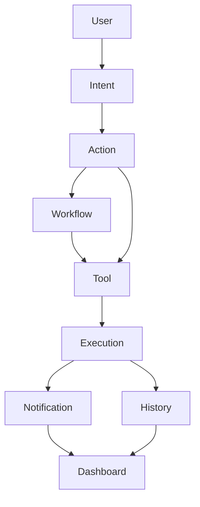

# Domain ICD

> **Status**: Proposed · **Progress**: 0% (통합 계약 기준 — 개별 Domain Progress는 각 문서 참조) · **Last Updated**: 2026-07-22 · **Owner**: Product/Architecture · **Version**: 0.1.0-draft

> **2026-07-22**: 이 폴더를 포함한 전체 개발 절차(SOP)는 [../../docs/workflow.md](../../docs/workflow.md)를
> 본다 — Step 0(Domain Freeze)이 이 폴더를 가장 먼저 확인하도록 정의되어 있다.

## 이 폴더가 정의하는 것 / 정의하지 않는 것

지금까지 이 저장소에는 **Backend API ICD**(`backend/docs/api/*`,
[docs/icd/action_layer_api.md](../../docs/icd/action_layer_api.md))와
**Frontend Interface 문서**(`frontend/docs/*`)는 있었지만, 그 위에서
"비즈니스 도메인이 무엇인가"를 정의하는 계약은 없었다. LetMeKnow가
Dashboard Application이 아니라 **Personal Action OS**로 개발되는 이상
([docs/strategy/product.md](../../docs/strategy/product.md)), API보다 상위
계층에서 도메인 간 계약을 먼저 정의해야 한다 — 이 폴더가 그 계층이다.

이 폴더는:
- **정의하지 않는다**: REST API 스펙, Flutter State/Widget, DB Schema.
  이것들은 전부 Domain 계약을 구현하는 *수단*이다.
- **정의한다**: 각 도메인의 존재 이유, 핵심 개념(Entity), 책임(하는 일/하지
  않는 일), 상태, 이벤트, 입출력, 다른 도메인과의 관계.

> **Backend/Frontend를 분리된 프롬프트 세션으로 구현할 때**: 이 폴더의 문서
> 단독으로는 구현할 수 없다(의도적으로 REST/State/DB를 적지 않았기 때문).
> 어떤 문서를 함께 넣어야 하는지, 어떤 순서로 진행해야 하는지는
> [docs/icd/prompt_playbook.md](../../docs/icd/prompt_playbook.md)를 먼저 본다.

Backend와 Frontend는 **API가 아니라 이 Domain ICD를 기준으로** 구현한다 —
API는 Domain ICD를 구현하는 수단일 뿐이다.

## 문서 목록

| Domain | 문서 | Owner | Progress |
|---|---|---|---|
| Intent | [intent.md](intent.md) | Action Layer (Core) | 0% |
| Action | [action.md](action.md) | Action Layer (Core) | 0% |
| Tool | [tool.md](tool.md) | Integrations/Connectors | 25% |
| Workflow | [workflow.md](workflow.md) | Action Layer (Core) | 0% |
| Calendar | [calendar.md](calendar.md) | Integrations/Productivity | 25% |
| Reminder | [reminder.md](reminder.md) | Integrations/Productivity | 0% |
| Notification | [notification.md](notification.md) | Platform/Delivery | 0% |
| Dashboard | [dashboard.md](dashboard.md) | Frontend/UX | 25% |
| HomeAssistant | [homeassistant.md](homeassistant.md) | Integrations/IoT | 0% |
| NAS | [nas.md](nas.md) | Integrations/Infrastructure | 0% |
| User | [user.md](user.md) | Platform/Identity | 75% |
| Weather | [weather.md](weather.md) | Integrations/Productivity | 75% |
| Todo | [todo.md](todo.md) | Integrations/Productivity | 0% |
| Settings | [settings.md](settings.md) | Platform/Identity | 50% |

Weather/Todo/Settings는 2026-07-22에 추가됐다 — 최초 11개 Domain에서 누락이
지적된 항목([domain_analysis.md](domain_analysis.md) "누락된 Domain")과,
User Domain의 `Preference`를 분리한 것(Settings)이다. OAuth/Google
Login/Google Calendar는 별도 Domain을 만들지 않고 각각 User Domain([user.md](user.md) —
인증/세션/권한)과 Tool Domain·Calendar Domain([tool.md](tool.md), [calendar.md](calendar.md) —
실제 Google 연동)에 흡수했다.

추가 분석(누락/중복/불필요 Domain, MVP/Phase2/Phase3 우선순위)은
[domain_analysis.md](domain_analysis.md)를 본다.

## 핵심 실행 모델

**모든 문서 형식**은 각 Domain 문서 상단의 메타데이터(Status/Progress/Last
Updated/Owner/Version) + 아래 9개 섹션(Purpose, Domain Model,
Responsibilities, State, Events, Inputs, Outputs, Relationships, Future
Extensions, References)을 따른다.

**LetMeKnow의 핵심 실행 모델**은 아래 흐름이며, 향후 모든 기능은 이 구조를
따른다:



```
User
  ↓
Intent
  ↓
Action
  ↓
Workflow   (다단계인 경우에만 개입 — 단일 Action이면 생략)
  ↓
Tool
  ↓
Execution
  ↓
Notification
  ↓
Dashboard
  ↓
History
```

| 단계 | 정의하는 문서 | 한 줄 요약 |
|---|---|---|
| User | [user.md](user.md) | 누가 요청했는가, 무엇을 할 권한이 있는가 |
| Intent | [intent.md](intent.md) | 자연어를 구조화된 의도로 변환 |
| Action | [action.md](action.md) | 의도를 실행 가능한 단위로 검증·선택·추적 |
| Workflow | [workflow.md](workflow.md) | 여러 Action을 조건/순서와 함께 조합(선택적 단계) |
| Tool | [tool.md](tool.md) | 실제 외부 시스템과 통신하는 어댑터 |
| Execution | [action.md](action.md) (Action Domain의 하위 개념) | Tool 호출의 1회 실행 인스턴스 |
| Notification | [notification.md](notification.md) | 결과를 사용자에게 전달할지/어떻게 전달할지 |
| Dashboard | [dashboard.md](dashboard.md) | 현재 상태를 시각화만 함(로직 없음) |
| History | [action.md](action.md) (Action Domain의 하위 개념) | 과거 실행 기록 축적 — Dashboard/Notification이 참조 |

**주의**: History는 별도 Domain 문서를 만들지 않았다 — Action Domain의
책임(`History` Entity, [action.md](action.md) Domain Model 참조)으로 정의했다.
Execution도 마찬가지로 Action Domain 산하 개념이다. 이 흐름도 상에서
독립된 박스로 그린 것은 실행 모델의 단계를 명확히 보이기 위함이며, 문서
소유권까지 분리한다는 뜻은 아니다.

## 도메인별 "하지 않는 일"이 왜 중요한가

이 Domain ICD의 각 문서는 "책임"만큼 "하지 않는 일"을 명시하는 데 공을
들였다. 이유는 [docs/strategy/product.md](../../docs/strategy/product.md)가
지적한 실제 문제 때문이다 — 지금까지 Dashboard(Frontend)가 사실상 모든
로직을 떠안아 왔다(예: Chat이 LLM을 직접 호출, Calendar Widget이 로컬
데이터만 참조). Domain 경계가 명시적이지 않으면 같은 실수가 반복된다.
특히 [dashboard.md](dashboard.md)는 "Business Logic/Intent/Execution을
포함하지 않는다"를 최상위 규칙으로 못박았다.

## 관련 문서

- [../README.md](../README.md) — Requirement 작성/추적 절차(RDD)
- [../../docs/strategy/product.md](../../docs/strategy/product.md), [../../docs/strategy/architecture.md](../../docs/strategy/architecture.md)
- [../../docs/icd/README.md](../../docs/icd/README.md) — API 계층(이 Domain ICD의 구현 수단)
- [domain_analysis.md](domain_analysis.md) — 누락/중복/불필요 Domain 분석 + 우선순위

---

# Change Log

- **2026-07-21** — Personal Action OS 전략에 따라 Domain ICD 최초 작성.
