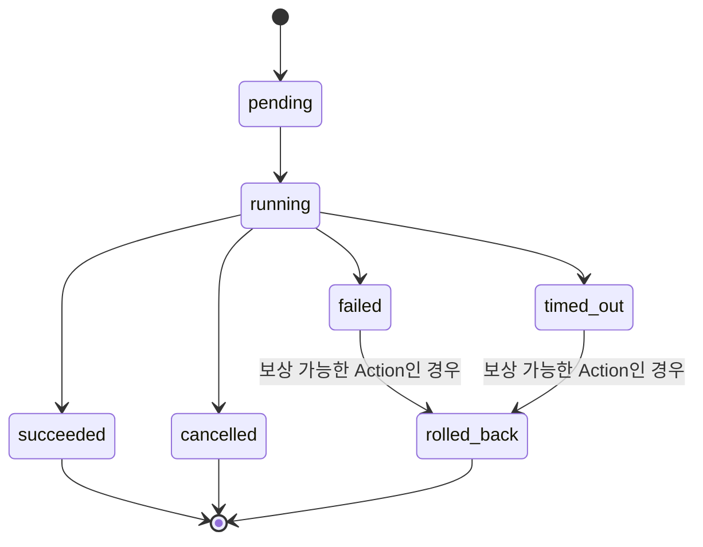

# Action Domain

> **Status**: Proposed · **Progress**: 0% · **Last Updated**: 2026-07-21 · **Owner**: Action Layer (Core) · **Version**: 0.1.0-draft

**프로젝트 전체에서 가장 중요한 Domain.** 비즈니스 계약만 정의한다 — REST API,
Flutter State, DB Schema는 이 문서의 범위가 아니다(구현 수단:
[docs/icd/action_layer_api.md](../../docs/icd/action_layer_api.md), Requirement:
[requirements/action_requirements.md](../action_requirements.md)).

> Backend/Frontend를 분리된 프롬프트 세션으로 구현할 때는 이 문서 단독으로
> 넣지 말 것 — 위 API 문서를 반드시 함께 넣는다. 필수 동반 문서 매트릭스와
> 실행 순서는 [docs/icd/prompt_playbook.md](../../docs/icd/prompt_playbook.md) 참고.

---

# Purpose

Action은 "사용자의 의도를 실제 결과로 바꾸는" LetMeKnow의 존재 이유 그 자체다.
[docs/strategy/product.md](../../docs/strategy/product.md)의 Core Philosophy —
"Dashboard는 제품이 아니다. Action Layer가 제품이다" — 가 정의하는 제품의
중심이 바로 이 Domain이다.

# Domain Model

| Entity | 설명 |
|---|---|
| **Action** | 실행 가능한 최소 단위의 정의(`type` + 입력 스키마). Tool 하나에 대응하거나, Workflow 안의 한 step일 수 있다. |
| **ActionRequest** | 특정 Intent(또는 직접 API 호출)로부터 만들어진, 실행 대기 중인 Action 인스턴스 요청. |
| **Execution** | ActionRequest가 실제로 실행되는 1회 인스턴스. |
| **ExecutionResult** | Execution이 끝났을 때의 정규화된 산출물(성공 데이터 또는 실패 사유). |
| **History** | 사용자별로 누적되는 과거 Execution의 기록. |

# Responsibilities

**한다**
- Intent(또는 Workflow의 한 step, 또는 직접 API 호출)로부터 ActionRequest를 받아
  실행 가능 여부를 검증한다(Validation).
- 실행할 Tool을 선택한다(Action Selection) — 어떤 Tool이 존재하고 사용자가
  연결했는지는 Tool Domain에 위임 조회한다.
- Execution을 시작·추적하고 ExecutionResult를 생성한다.
- 모든 Execution을 History에 남긴다.
- ExecutionResult를 Notification Domain에 전달한다(사용자에게 알릴지 여부는
  Notification이 결정).
- Dashboard가 참조할 "최신 상태"를 갱신한다(Dashboard Update) — 단, Dashboard
  자체를 조작하지는 않는다(순수 상태 발행만).

**하지 않는다**
- 자연어를 해석하지 않는다 — Intent Domain의 산출물을 받을 뿐이다.
- 외부 시스템을 직접 호출하지 않는다 — 실제 호출은 Tool Domain의 책임이다
  (Action은 Tool에 "무엇을 해달라"고 요청만 한다).
- 여러 Action의 실행 순서/조건/재시도 전략을 스스로 계획하지 않는다 — 이는
  Workflow Domain의 책임이다(Action은 Workflow의 한 step으로 호출될 수 있을 뿐).
- 사용자에게 직접 알리지 않는다 — Notification Domain에 위임한다.
- 화면을 그리지 않는다 — Dashboard Domain에 위임한다.

# Lifecycle (필수)

```
Natural Language
      ↓
    Intent
      ↓
   Validation
      ↓
 Action Selection
      ↓
   Execution
      ↓
 Execution Result
      ↓
    History
      ↓
  Notification
      ↓
 Dashboard Update
```

| 단계 | 책임 Domain | 비고 |
|---|---|---|
| Natural Language → Intent | Intent Domain | [intent.md](intent.md) |
| Validation | **Action Domain** | Intent의 Parameter가 충분한지, 사용자 권한이 있는지(User Domain 조회) 확인 |
| Action Selection | **Action Domain** | `TargetServiceRef`로 후보를 좁히고, Tool Domain에 연결 상태를 조회해 최종 Tool을 선택 |
| Execution | **Action Domain** + Tool Domain | Action이 Tool에게 실행을 요청하고, Tool이 외부 시스템과 통신 |
| Execution Result | **Action Domain** | Tool의 원시 응답을 정규화 |
| History | **Action Domain** | 사용자별 Execution 이력 누적 |
| Notification | Notification Domain | [notification.md](notification.md) |
| Dashboard Update | Dashboard Domain | [dashboard.md](dashboard.md) — 상태 반영만, 로직 없음 |

# State

> **정정 2026-07-21 — 이 표가 State 이름의 단일 기준(canonical)이다.**
> 이전 버전은 여기(PascalCase, `Cancelled`만 있고 `timed_out` 없음)와
> [docs/icd/action_layer_api.md](../../docs/icd/action_layer_api.md)(소문자,
> `timed_out`만 있고 `cancelled` 없음)가 서로 다른 이름을 쓰고 있었다 — front/back을
> 분리해 각각 프롬프트로 구현을 맡길 경우 이런 불일치는 그대로 서로 다른 구현으로
> 굳어진다. 아래가 두 문서 공통의 최종 값이며, `action_layer_api.md`는 이 표를
> 그대로 인용한다. 실제 코드의 상태값도 아래 소문자 snake_case를 그대로 사용한다.



| State | 의미 |
|---|---|
| `pending` | Validation 통과, 실행 대기 |
| `running` | Tool에 실행 요청을 보낸 상태 |
| `succeeded` | ExecutionResult 정상 수신 |
| `failed` | Tool 실행 오류(타임아웃 제외) |
| `timed_out` | 지정된 시간 내 응답 없음 — `failed`와 별개 상태로 구분한다(원인 분석과 재시도 정책이 다르기 때문) |
| `cancelled` | 사용자 취소 또는 Intent가 Superseded됨 |
| `rolled_back` | 실패(`failed`/`timed_out`) 후 보상 로직으로 원복(모든 Action이 지원하지는 않음) |

# Events

| Event | 발생 시점 | 소비자 |
|---|---|---|
| `ActionValidated` | Validation 통과 | Tool Domain(실행 준비) |
| `ActionRejected` | Validation 실패(권한 부족, 잘못된 Parameter 등) | Notification Domain |
| `ExecutionStarted` | Tool에 실행 요청을 보냄 | Dashboard(진행 중 표시), History |
| `ExecutionCompleted` | 성공 종료 | History, Notification, Dashboard Update |
| `ExecutionFailed` | 실패 종료 | History, Notification |
| `ExecutionCancelled` | 취소됨 | History |

# Inputs

- Intent Domain의 `Intent` 객체(주 경로)
- Workflow Domain이 호출하는 개별 step 정의(부 경로 — [workflow.md](workflow.md))
- 직접 API 호출(자동화, 개발자 도구 등 — Intent를 거치지 않는 예외 경로)

# Outputs

- `ExecutionResult`: `{ status, data | error, tool_ref, started_at, completed_at }`
- `History` 항목(사용자별 누적 조회 가능한 형태)
- Notification Domain으로의 전달 신호
- Dashboard가 구독하는 "최신 상태" 신호

# Relationships

```
Intent
  ↓
Action
  ↓
Tool
  ↓
Execution
  ↓
Notification
  ↓
Dashboard
```

- **Intent Domain**: Action의 유일한 정상 입력원([intent.md](intent.md)).
- **Tool Domain**: Action은 Tool에 의존하지만, Tool은 Action의 존재를 모른다
  (단방향 의존 — [tool.md](tool.md)).
- **Workflow Domain**: 여러 Action을 묶어 실행할 때, Workflow가 Action을
  개별 step으로 호출한다([workflow.md](workflow.md)) — Action은 자신이
  Workflow의 일부인지 알 필요가 없다.
- **User Domain**: 모든 Execution은 특정 User에 귀속된다([user.md](user.md)).
- **Notification Domain**: ExecutionResult를 전달받아 사용자 알림 여부를 결정([notification.md](notification.md)).
- **Dashboard Domain**: Action의 최신 상태를 시각화 전용으로 구독([dashboard.md](dashboard.md)).

# Future Extensions

- Rollback/보상 전략의 표준화(현재는 Action별 개별 지원 여부만 명시)
- Execution 우선순위/큐잉(동시 다발 Action 처리)
- Confidence 기반 자동 실행 vs 사용자 확인 임계치 정책

# References

- Backend: [backend/docs/routes/README.md](../../backend/docs/routes/README.md), [backend/docs/database/README.md](../../backend/docs/database/README.md)(신규 테이블 제안 배너)
- Frontend: [frontend/docs/ui/AodDisplay.md](../../frontend/docs/ui/AodDisplay.md), [frontend/docs/state/Overview.md](../../frontend/docs/state/Overview.md)
- Strategy: [docs/strategy/product.md](../../docs/strategy/product.md), [docs/strategy/architecture.md](../../docs/strategy/architecture.md) (Layer 1)
- Requirement: [requirements/action_requirements.md](../action_requirements.md)
- API 구현(수단): [docs/icd/action_layer_api.md](../../docs/icd/action_layer_api.md)
